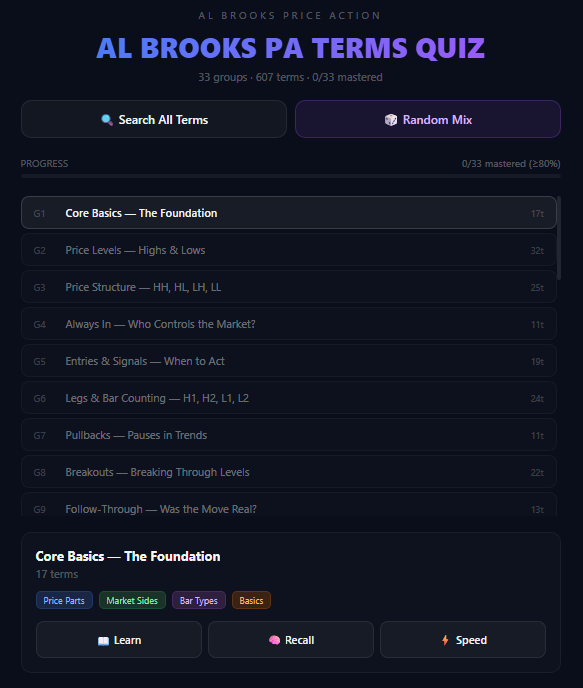

# Al Brooks PA Terms Quiz

An interactive Progressive Web App (PWA) to master Al Brooks' price action trading terminologies through category sorting with spaced repetition.

## 📖 About

This quiz helps traders learn and retain over 600+ Al Brooks price action abbreviations and terminologies. Terms are organized into 33 logical categories, making it easier to understand the context and relationships between concepts.

**Key Features:**
- 🃏 **607+ trading terms** across 33 categories
- 🎮 **Drag-and-drop gameplay** (desktop) or tap-to-sort (mobile)
- 🧠 **Spaced repetition** for better long-term retention
- 📱 **Installable PWA** — works offline, saves progress
- 🔍 **Search all terms** with instant filtering
- 📊 **Track progress** by category with mastery percentages
- ⚡ **Three difficulty levels:** Learn, Recall, and Speed mode

## 🎯 Game Modes

| Level | Mode | Description |
|-------|------|-------------|
| 1 | 📖 Learn | See both abbreviation and meaning while sorting |
| 2 | 🧠 Recall | Abbreviation only — test your memory |
| 3 | ⚡ Speed | Recall mode with timer — beat the clock |

## 📱 Install as App

### On iPhone (iOS):
1. Open `https://sunnyjamiel.github.io/al-brooks-pa-terms-trainer/` in Safari
2. Tap the **Share button** (square with arrow)
3. Scroll down and tap **"Add to Home Screen"**
4. Tap **"Add"** in top right
5. Launch from home screen like any native app

### On Android:
1. Open in Chrome
2. Tap the **three-dot menu**
3. Tap **"Add to Home screen"**
4. Follow the prompts

### On Desktop (Chrome/Edge):
1. Click the **install icon** (➕) in the address bar
2. Click **"Install"**

## 🎮 How to Play

1. **Choose a category group** from the main menu
2. **Select difficulty level** (Learn, Recall, or Speed)
3. **Drag** (desktop) or **tap** (mobile) each term to its correct category
4. **Build streaks** for correct answers
5. **Track progress** — groups with ≥80% correct are "mastered"
6. **Review mistakes** at the end of each round

## 🗂️ Term Categories

Terms are organized into 33 groups including:
- Core Basics (O, H, L, C, BL, BR)
- Price Levels (HD, LD, HOD, LOD)
- Always In (AI, AIL, AIS)
- Entries & Signals (SB, EB, 2E)
- Pullbacks & Breakouts
- Wedges, Flags, and Channels
- And many more...

## 🚀 Development

This is a static PWA built with:
- Vanilla JavaScript (React via CDN)
- Service Worker for offline capability
- localStorage for progress tracking
- No build step — pure HTML/JS/CSS

### Local Development
1. Clone the repository
2. Open `index.html` in your browser
3. Make changes and refresh

### Deploy Updates
1. Make changes locally
2. Commit and push to GitHub
3. GitHub Pages auto-deploys within minutes

## 📊 Progress Tracking

Your progress is saved locally in your browser. Mastery is tracked per group:
- **≥80% correct** = Mastered (✅ appears in menu)
- Progress persists even after closing the browser

## 🤝 Contributing

Found a bug? Want to add terms? Feel free to open an issue or pull request.

## 📄 License

MIT — use freely, modify, share. Attribution appreciated but not required.

## 🙏 Credits

Created for the Al Brooks price action trading community. All terminologies based on the works of Al Brooks.

---

**Happy Trading!** 📈